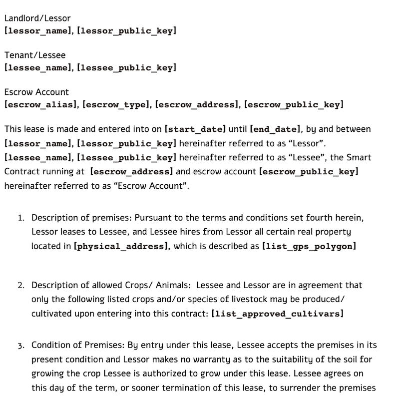

# Chainlink/Solana 2022 Hackathon Submission : Block Garden
* Building a landleasing agreement ecosystem for smaller suburban plots of land to utilize empty space and increase local food production.
* The contract requires margin to be posted by each party which is transferred to the other party if one is to void the contract for any reason if they are not satisfied with the arrangement.


## Roadmap Checkpoints

* 29   APR  TBD - (Basic funcionality with test/synthetic data of interest)
* 06   MAY  TBD - (Basic funcitonality with live data)
* 13   MAY	TBD - (Finished with Additional Features)
* 20   MAY  TBD - (Frontend BS/ Make pretty)
* 27   MAY	__Submission Due__ (Be one with the blockchain)
----- 
* 03  JUN  TBD - (Wrap up / Discuss any Further Developement Plans)


## Test Concept Block-Garden
Small Land-leasing contracts verifed via chainlink funded by Solana


## Prototype Contract
Sample contract with variables.


### Installation
Installing pipx
```bash
brew install pipx
```
Installing brownie [Link](https://eth-brownie.readthedocs.io/en/latest/install.html)
```bash
pipx install eth-brownie
```
Alternative Installation of brownie using pipenv (encountered error brownie using pyhotn 3.1)
```bash
pipenv --python 3.8
pipenv shell
pipenv install eth-brownie
```
Installing ganache-cli
```bash
npm install -g ganache-cli
```
Adding ganache as a test network
```bash
brownie networks add Ethereum ganache host=http://localhost:8545 chainid=1337
```
Running base tests (run commands in multiple terminals)
```bash
	npx ganache-cli
	brownie test —network ganache
```


## Useful links
* How to Deply a smart contract [with brownie](https://www.quicknode.com/guides/web3-sdks/how-to-deploy-a-smart-contract-with-brownie)
* Brownie [Documentation](https://eth-brownie.readthedocs.io/en/stable/init.html#creating-an-empty-project)
* [Installing](https://eth-brownie.readthedocs.io/en/latest/install.html) brownie
* Smart contract bootcamp: [brownie track](https://chain.link/bootcamp/brownie-setup-instructions)
* Brownie mix with [chainlink](https://github.com/smartcontractkit/chainlink-mix)

----- 
* Solana [Documentation](https://docs.solana.com)
* Chainklink [Documentation](https://docs.chain.link/?_ga=2.124500034.993353181.1649598364-607422185.1649598364)
* [Anchor](https://project-serum.github.io/anchor/getting-started/introduction.html), abstracts away complexities of smart contracts with Solana Sealevel runtime [install](https://book.anchor-lang.com/chapter_2/installation.html)
----- 
* Hackathon Specific [Documentation/ tutorial / boilerplate](https://docs.chain.link/docs/hackathon-resources/?_ga=2.212595676.993353181.1649598364-607422185.1649598364)
* The Chainlink Hackathon [Main Site](https://chain.link/hackathon) with calendar and rules
* The 16 hour solidity smart contract [tutorial](https://www.youtube.com/watch?v=M576WGiDBdQ)
* Last Seasons winners for reference [fall 2021](https://chain.link/hackathon/hackathon-2021-fall) & [previous hackathons](https://docs.chain.link/docs/example-projects/)
* Solana's novel attributes described: e.g. [proof of history](https://medium.com/solana-labs/proof-of-history-a-clock-for-blockchain-cf47a61a9274)
* Solana version of etherscan : [Solana Explorer](https://explorer.solana.com)
----- 
* Basic smart contract that displays how many times you access it [Here](https://blog.chain.link/how-to-build-and-deploy-a-solana-smart-contract/)
* Simple Tutorial to send yourself test Solanas [Here](https://docs.google.com/document/d/e/2PACX-1vTf4o3Va9TrwsFpYDnTLB8LpIwK1MUh0WIBtajio-Jk78aWlIKF-87BfFdRG2HcfExIq3WIFut_IwdA/pub?_hsmi=208190576&_hsenc=p2ANqtz--PLMIpMAPLBYFfEOVK21XVo822ctPlhBLHs1RawAvQynS-Dzg9rcNDgR0ZKX_3Ek3VKWHo-wWTegOX9-a8Vg6BcHROYA)
------


## Land Leasing Sample contract
[California Farm Link: Model Short Term Crop Lease Agreement](https://farmlandinfo.org/sample_documents/california-farm-link-model-short-term-crop-lease-agreement/)

## License
[MIT](https://choosealicense.com/licenses/mit/)

